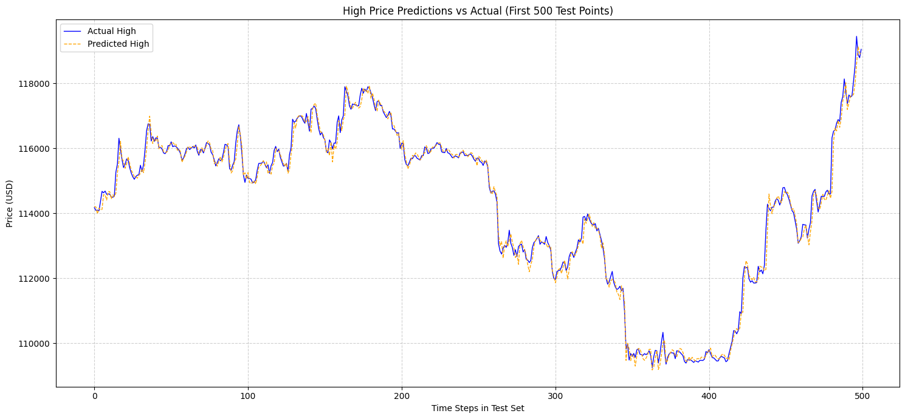
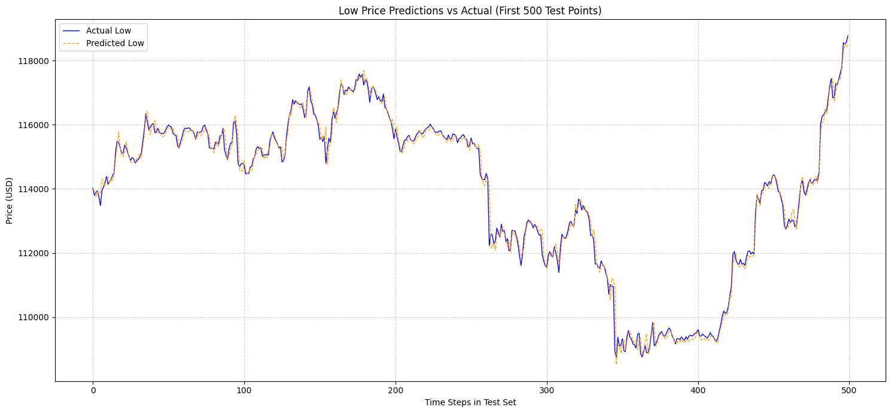

# Bitcoin Price Prediction Using N-BEATS

![OpenBB](https://img.shields.io/badge/OpenBB-lightgrey?style=for-the-badge&logo=data%3Aimage%2Fsvg%2Bxml%3Bbase64%2CPHN2ZyB2aWV3Qm94PSIwIDAgMTI2IDM0IiB3aWR0aD0iMTI2IiBoZWlnaHQ9IjM0IiBmaWxsPSJub25lIiB4bWxucz0iaHR0cDovL3d3dy53My5vcmcvMjAwMC9zdmciIGFyaWEtbGFiZWxsZWRieT0iT3BlbkJCIj48dGl0bGUgaWQ9Ik9wZW5CQiI%2BT3BlbkJCPC90aXRsZT48ZyBmaWxsPSJjdXJyZW50Q29sb3IiPjxwYXRoIGQ9Ik02MC43MDcgMS40MTZoLTkuMjg1djQuMjVoOS4yODV2MS40MmgtNy44NTR2NC4yNWg5LjI4M1YxLjQyM2gtMS40MjhsLS4wMDEtLjAwN1ptMCA3Ljc5M3YuNzA3SDU0LjI4VjguNWg2LjQyN3YuNzA5Wm0wLTUuNjY4di43MWgtNy44NTRWMi44MzFoNy44NTVsLS4wMDEuNzFaTTY5Ljk5IDExLjMzM2gyLjg1MlY3LjA4N0g2NC45OVY1LjY3MWg5LjI4NVYxLjQySDYzLjU2MnY5LjkxM2g2LjQyOFptLTUtNy43OTF2LS43MDloNy44NTJWNC4yNUg2NC45OXYtLjcwOVptMi44NTggNi4zNzVINjQuOTlWOC41aDYuNDM4djEuNDE3aC0zLjU4Wk02My41NjMgMGgtMS40Mjh2MS40MTZoMS40MjhWMFpNNzguNTE5IDIyLjcydjguNDU5bC0uNzEyLS43MDQtLjcxLS43MDYtLjcxLS43MDQtLjcxLS43MDYtLjcxMi0uNzA0LS43MTItLjcwNS0uNzEtLjcwNC0uNzEtLjcwNi0uNzEtLjcwNi0uNzEyLS43MDQtLjcxLS43MDQtLjcxMS0uNzA1aC0xLjQyMlYzMy45OThoMS40MjJWMjQuODM0bC43MTEuNzA2LjcxLjcwNi43MTEuNzA0LjcxLjcwNS43MTIuNzA0LjcxLjcwNi43MS43MDQuNzEyLjcwNi43MS43MDQuNzEyLjcwNS43MS43MDYuNzEuNzA0LjcxLjcwNGguNzEyVjIyLjcyMUg3OC41MlpNMTAxLjQwMiAyNi45NWgtMS40MjF2LTQuMjNoLTguNTI4VjM0aDExLjM3NHYtNy4wNTdoLTEuNDIybC0uMDAzLjAwN1ptLTguNTI4LS43MXYtMi4xMWg1LjY4NXYyLjgyaC01LjY4NXYtLjcxWm04LjUyOCAyLjgydjMuNTI4aC04LjUyOHYtNC4yMjdoOC41Mjh2LjY5OVpNMTI0Ljk4NiAyNi45NWgtMi4xMzF2LTQuMjNoLTguNTI5VjM0aDExLjM3di03LjA1N2wtLjcxLjAwN1ptLTkuMjM5LS43MXYtMi4xMWg1LjY4N3YyLjgyaC01LjY4NXYtLjcxWm04LjUzIDIuODJ2My41MjhoLTguNTN2LTQuMjI3aDguNTN2LjY5OVpNNDUuNzgyIDIyLjcySDM1LjgzNHYxMS4yNzhINTUuNzMyVjMyLjU5SDQ3LjIwNFYyOS43N0g1NS43Mjh2LTEuNDFoLTguNTI0VjI0LjEzSDU3LjE1VjIyLjcyMWgtMS40MThaTTkuOTUgMjIuNzJILjAwM1YzNGgxMS4zNzJWMjIuNzJIOS45NVptMCAyLjExNnY3Ljc1NEgxLjQyM3YtOC40Nkg5Ljk1di43MDZaTTMyLjg1NSAyMi43MjFoLTkuOTQ5djExLjI4aDEuNDIyVjI5Ljc3aDkuOTQ4di03LjA1N2gtMS40MjF2LjAwOFptMCAyLjExNnYzLjUyOGgtOC41Mjd2LTQuMjI3aDguNTI3di43MDZaIiBmaWxsPSIjMDAwMDAwIi8%2BPC9nPjwvc3ZnPg%3D%3D&logoColor=white&logoSize=big)

This is a replication study of the research paper "**Bitcoin Price Prediction Using N-BEATS ML Technique**" published in *EAI Endorsed Transactions on Scalable Information Systemsby* by G. Asmat and K. M. Maiyama. The project evaluates the efficacy of the Neural Basis Expansion Analysis Time Series (N-BEATS) architecture in forecasting Bitcoin prices, specifically focusing on its ability to handle the extreme volatility, nonlinearity and stochasity of cryptocurrency markets.

## 1. Project Overview
Cryptocurrency markets are characterized by high-frequency fluctuations and non-linear dependencies. This project demonstrates how the N-BEATS deep learning architecture provides a robust prediction by decomposing time series into interpretable trend and seasonality components comparing to traditional models such as Linear Regression and Long-Short-Term-Memory (LSTM) network.

## 2. Key Features
- **Data:** Most recent 729 days of hourly Bitcoin price data, sourced from Yahoo Finance.
- **Pre-processing:**
  - Implementation of Min-Max scaling to normalize features (Open, High, Low, Close, Adj Close, Volume).
  - Data reshaping into 3D structures for compatibility with deep learning layers.
- **Model:** The N-BEATS model utilizes a series of stacks and blocks to perform "backcasting" and "forecasting," allowing the network to identify complex temporal patterns without manual feature engineering.
- **Prediction:** Application of a 3-hour look-back window to predict the subsequent hour's High and Low prices.
- **Evaluation:**
  -  **R-squared ($R^2$)**: indicating the percentage of variation in a dependent variable that is explained by an independent variable(s) in a regression model. It's Ranging from 0 to 1 (0% to 100%), it represents how well a model fits the data, with 1 indicating a perfect fit.
  -  **Mean Absolute Error (MAE)**: a foundational regression model metric that measures the average magnitude of errors between predicted and actual values.It's calculated as the average of the absolute differences, lower MAE scores (0 is ideal) indicate better performance:

$$MAE = \frac{1}{n} \sum_{i=1}^n |y_i - \hat{y}_i|$$

  -  **Performance Comparison**:

   | Model | $R^2$ score | Mean Absolute Error (MAE) |
   |     :---:      |     :---:      |     :---:      |
   | N-BEATS         | 0.998924      | 0.00220156367       |
   | Linear Regression         | 0.9645      | 0.008994       |
   | LSTM network      | 0.9263      | 0.04753       |

  - **Interpretability:** Decomposition of predictions into trend and seasonality blocks.
  - **Results:** The N-BEATS model demonstrated superior performance in capturing Bitcoin's volatile price movements compared to traditional and recurrent neural network baselines, particularlly, a robust trend capturing during high-volatility periods.

## 3. Bitcoin Prices Comparison: Actual vs Prediction

## 4. N-BEATS Mathematical Formulation
The Neural Basis Expansion Analysis for Time Series (N-BEATS) is a deep learning architecture specifically engineered for time series forecasting without the need for domain-specific feature engineering. It is characterized by a hierarchical structure of blocks and stacks that utilize fully connected layers and residual connections to decompose data into interpretable signals like trend and seasonality.
### Block Operation
For each block $b$ with input $x_{b}$, the model computes a set of expansion coefficients ($\theta$) using fully connected layers:

$$\theta_{b}^{f} = FC_{b,f}(x_{b}) \quad \text{and} \quad \theta_{b}^{b} = FC_{b,b}(x_{b})$$

Where $FC$ represents the fully connected layers.
### Basis Expansion
The forecast ($\hat{y}_{a}$) and backcast ($\hat{y}_b$) are then generated by projecting these coefficients onto basis functions ($g$):

$$\hat{y}_{b} = \sum_{i=1}^{\text{dim}(\theta_{b}^{f})} \theta_{b,i}^{f} g_{i}^{f} \quad \text{and} \quad \hat{x}_{b} = \sum_{i=1}^{\text{dim}(\theta_{b}^{b})} \theta_{b,i}^{b} g_{i}^{b}$$

The basis functions $g$ can be generic (like a polynomial for trend) or learned through the network.
### Residual Hierarchy (Backcasting)
The input for the next block ($x_{b+1}$) is the residual of the previous backcast:

$$x_{b+1} = x_{b} - \hat{x}_{b}$$

This enables the "decomposition" mentioned in the paper, as each block subtracts what it has already "explained" from the input.
### Global Forecast
The final prediction ($\hat{y}$) is the sum of all individual block forecasts across the entire stack:

$$\hat{y} = \sum_{b} \hat{y}_{b}$$

This summation allows the model to combine short-term oscillations and long-term trends into a single, highly accurate Bitcoin price prediction.

## 5. Hyperparemeter Tuning
Predetermined hyperparemeters which is the same as the replicated paper

   | Hyperparameters | Values |
   |     :---:      |     :---:      |
   | Sequence Length         | 3 hours      | 
   | Number of blocks          | 3      |
   | Units per block       | 128      |
   | Forecast dimension        | 2      |
   | Batch size        | 64      |
   | Epochs       | 50      |
   | Optimizer       | Adam      |

## 6. Technical Stack
- **Language:** `Python 3.12 64-bit`
- **Libraries:** :
  - `Pandas`: data structural manipulation
  - `NumPy`: reshaping the data
  - `yfinance`: data acquisition for historial Bitcoin data
  - `Scikit-Learn`: data processing, model selection by quantifying performance metrics, Train-Test sets model development
  - `TensorFlow 2.20.0`, `Keras`: deep learning framework to construct N-BEATS architecture with layers
  - `OpenBB`: collect unified data router and toolbox for financial analysis
  - `Matplotlib`: create data visulization
- **Environment:** `Jupyter Notebook`

## 7. References
Asmat, G., and K. M. Maiyama. “Bitcoin Price Prediction Using N-Beats ML Technique.” *EAI Endorsed Transactions on Scalable Information Systems*, April 1, 2025. https://doi.org/10.4108/eetsis.9006.

Mann , William. Quantitative Alpha In Crypto Markets: A Systematic Review of Factor Models, Arbitrage Strategies, and Machine Learning Applications. *HarmoniQ Insights, Quantitative Research and Technology Advisors*, 2025. https://papers.ssrn.com/sol3/papers.cfm?abstract_id=5225612. 

Maswood, Mirza Mohd, and Abdullah G. Alharbi. “Deep Learning-Based Stock Price Prediction Using LSTM and Bi-Directional LSTM Model.” *2020 2nd Novel Intelligent and Leading Emerging Sciences Conference (NILES)*, October 24, 2020, 87–92. https://doi.org/10.1109/niles50944.2020.9257950.

Nakamoto, Satoshi. Bitcoin: A peer-to-peer electronic cash system, 2008. https://bitcoin.org/bitcoin.pdf.

Oreshkin, Boris N., Dmitri Carpov, Nicolas Chapados, and Yoshua Bengio. “N-Beats: Neural Basis Expansion Analysis for Interpretable Time Series Forecasting.” arXiv.org, February 20, 2020. https://arxiv.org/abs/1905.10437.

Shumway, Robert H., and David S. Stoffer. “ARIMA Models. In: Time Series Analysis and Its Applications.” SpringerLink, January 1, 1970.

Wang, Minxing, Pavel Braslavski, and Dmitry I. Ignatov. “TimeGPT’s Potential in Cryptocurrency Forecasting: Efficiency, Accuracy, and Economic Value.” Forecasting 7, no. 3 (September 10, 2025): 48. https://doi.org/10.3390/forecast7030048.

## 8. Special Thanks
I am deeply grateful to [William Mann](https://www.linkedin.com/in/william-mann-cfa/), the Managing Partner of [HarmoniQ Insights](https://www.harmoniqinsights.com/), for the invaluable insights and technical codebase provided in his [2025 research](https://papers.ssrn.com/sol3/papers.cfm?abstract_id=5225612), which served as a foundational resource for the implementation and validation of this replication study.
